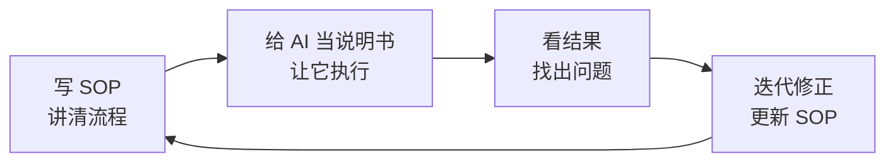

# AI 小白也能听懂的实用指南

  让 AI 成为你的"兼职员工"

  zhixian · <a href="https://x.com/zhixianio" class="opacity-100">@zhixianio</a>

  2026 年 4 月 · 在日华人创业者分享

<!--
大家好，我是 zhixian。今天想跟各位在日本做生意的朋友聊聊 AI——但不是聊那些花哨的概念，而是聊怎么真正把它用起来，变成你生意里的"兼职员工"。
-->

---
layout: center
---

# 关于我

Agent 训练师，生活在日本 
深度 AI 工具使用者 —— 日均与 AI 交互 **100+ 次** 
用 Telegram / Discord 等聊天平台 + AI Agent 管理生活和工作

zhixian.io  ·  @zhixianio

<!--
简单自我介绍。我自己是开发者背景，生活在日本。这几年我把自己的生活和工作大量交给了 AI 来协助——日均跟 AI 的对话次数超过 100 次。今天分享的内容都是我自己用出来的经验，不是听说或者纸上谈兵。
-->

---
layout: section
---

# 为什么日本是 AI 落地的最佳土壤

<!--
在开始讲方法之前，我想先聊一个观察——为什么我觉得日本，以及在日本做生意的我们，是最应该抓住这波 AI 机会的人。
-->

---

# 两个独特优势

### 🗾 工作流程极致细致

- 日本企业以"细致流程 / SOP"闻名
- 过去：对人的一种压抑
- 现在：**AI 最好的业务围栏**

流程越规范 → AI 越能可靠执行

### 👥 人口结构的双重压力

- **劳动力短缺** → AI 替代人力、补齐产能
- **社会老龄化** → AI + 智能硬件 / 机器人，做陪伴与照护

AI 在日本不是"锦上添花"，而是**必答题**

<!--
第一个优势：日本的工作流程以细致著称。过去这种"事无巨细写清楚"对人来说是一种压抑——大家都在抱怨日本职场的死板。但放到 AI 时代，这个特点变成了最大的红利。因为 AI 最怕的就是"模糊指令"。你的流程越清楚、SOP 越完整，AI 就越能可靠地执行。你们过去被迫做的这些流程梳理工作，现在变成了 AI 落地的基础设施。

第二个优势：日本的人口结构有双重压力，也对应着 AI 的双重机会。一面是劳动力短缺——招人越来越难、越来越贵，AI 正好可以替代和补齐人力；另一面是老龄化——这是 AI 加上智能硬件、机器人最有价值的落地场景，做陪伴、做照护。所以对做生意的人来说，AI 已经不是"试一试"，是"必答题"。
-->

---
layout: center
class: text-center
---

核心理念

# 不讲工具清单

## 讲**思路**

工具每月都在换，思路能用五年

（下一页会给一张"全景地图"帮你对位， 不是推荐清单，是让你知道自己大概在哪个位置）

<!--
好，进入正题。今天我不想给大家一个"十个必备 AI 工具清单"——因为这种清单你们回去搜一下就有，而且工具每个月都在更新，今天给的清单可能下个月就过时了。

我想讲的是思路和方法。为什么？因为工具会一直换，但好的思路你能用五年、十年。只要你掌握了怎么思考这件事，工具换了你也能快速上手。

不过在讲方法之前，我会先给大家看一张"全景地图"——不是推荐清单，是一张坐标系，让你知道 AI 工具大致分几层、你现在在哪一层。后面讲方法举例时你们就能对号入座。
-->

---
layout: section
---

# 先看一张地图

## AI 工具光谱：从轻到重

<!--
但是讲方法之前，我得先给大家一张地图——当下 AI 工具的整体光谱是什么样的。因为后面讲方法时会举很多例子，有了这张地图你们就能对号入座。
-->

---

# AI 工具光谱 （一张地图，不是推荐清单）

| 级别 | 类型 | 代表工具（举例） | 适合场景 |
|:----:|:-----|:---------|:---------|
| 🟢 最轻 | 搜索增强 | Google AI, Perplexity, ChatGPT Search | 查资料、调研、了解陌生领域 |
| 🟢 轻量 | 通用聊天 | ChatGPT, Gemini, Grok, 小红书问一问 | 写文案、翻译、讨论想法 |
| 🟡 中等 | 垂直工具 | Codex (写代码), Granola (会议纪要), Gamma (做 PPT) | 专业任务，比通用 AI 更强 |
| 🟠 较重 | 个人助手 PA | OpenClaw 等 | 跨工具、有记忆、多轮协作 |
| 🔴 最重 | 自建工作流 | n8n, Dify, API + 脚本 | 稳定重复业务，深度自动化 |

💡 **这里列工具只是帮你定位层级——重点不是"用哪个"，而是"你该在哪一层"。工具越重投入越大回报也越大，不需要一步到位，从最轻的开始即可。**

<!--
这张表从上到下是"轻到重"的 AI 工具光谱。

最轻的是搜索增强型，像 Google AI、Perplexity——你问它问题，它给你答案，取代传统的 Google 搜索。门槛零，大多数人都用过。

轻量一层是通用聊天机器人，ChatGPT、Gemini、Grok 各有各的特点。Gemini 跟 Google 生态结合好，Grok 实时性强，ChatGPT 综合能力稳定。小红书的"问一问"也越做越好，而且特别懂中文生活场景。

中等这一层是垂直工具——针对特定任务做得比通用 AI 更专业。比如写代码用 Codex，开会记录用 Granola，做 PPT 用 Gamma。

较重这一层是个人助手（PA），像我一直在用的 OpenClaw。它的特点是有记忆、能跨工具工作、可以替你跑多轮任务。这需要一些配置，但一旦用起来威力很大。

最重的是自己搭工作流——用 n8n、Dify 这类工具，或者直接调 API 写脚本。这适合你的生意里有非常稳定、重复、高价值的流程，值得投入做深度自动化。

重点：**不需要一步到位**。从你最轻松能上手的开始，慢慢往下走。
-->

---
layout: section
---

# 我们的目标

## 把 AI 变成你的 **兼职员工**

不是一个魔法按钮，也不是一个搜索框

是一个你招进来、培训、管理、给反馈的"员工"

<!--
讲方法之前，先把今天的"目标"说清楚——我们不是来玩工具的，我们是来招一个员工的。

不是当成搜索引擎、不是当成魔法按钮。目标是：让 AI 成为你生意里一个真正能干活的兼职员工——有能力、也有边界、需要你招进来、培训、管理、给反馈。

接下来讲的三个阶段，就是一个老板"把 AI 员工从试用期带到骨干"的三个阶段。
-->

---
layout: center
class: text-center
---

成熟度阶段

# 三个阶段

L 1

### 省时间

优化现有流程

解放你自己

L 2

### 规模化

AI 接管工作流

放大你的能力

L 3

### 创造

磨合出新可能

催生新的业务

<!--
三个阶段是递进的：

第一阶段 L1：省时间。最直接的价值——把你每天浪费在重复工作上的时间省下来。

第二阶段 L2：规模化。当你把流程梳理清楚交给 AI，你会发现你的能力被放大了——同样的时间可以做以前三倍的事。

第三阶段 L3：创造。当你对 AI 的能力边界足够熟悉，你会发现一些以前根本不可能的事情现在可以做了，这会催生新的工作方式甚至新的业务。

大多数人卡在 L1，因为他们把 AI 当工具用，没有把 AI 当员工管。
-->

---
layout: section
---

# L1 · 省时间

## 优化现有流程，解放你自己

<!--
先讲第一阶段——最好上手的一层。
-->

---

# L1 的核心方法

### 三步走

1. **盘点重复** — 列出你每天/每周重复做的事情
2. **拆分类型** — 分成"需要判断"和"纯执行"两类
3. **交出执行** — 纯执行的部分交给 AI，你只做判断

<v-click>

💡 **关键洞察**：很多事情你以为必须自己做，其实里面只有 10-20% 需要你的判断力，剩下 80% 都是执行。把那 80% 拿出来交给 AI。

</v-click>

<!--
L1 的方法很简单，三步：

第一步：盘点。拿张纸列出你每天、每周在做的事情。大到谈判客户、小到回复邮件。

第二步：拆分。把这些事情分成两类——"需要你判断"的和"纯执行"的。比如"决定是否接受一个合作"是判断，"把合作内容写成正式邮件"是执行。

第三步：把执行交给 AI，你只做判断。

关键洞察：很多你觉得自己必须做的事，仔细拆分后会发现，只有 10-20% 真的需要你的判断力，剩下 80% 都是执行层。把这 80% 拿出来，你就省下了大量时间。
-->

---

# L1 · 我的实例

### 💬 信息整理
每天收到的资讯、邮件、群消息，我让 AI 帮我筛选、摘要、打标签，剩下的只是快速扫一眼决定要不要深看。

### 📝 初稿生产
所有的文章、邮件、公众号、推文，我都先让 AI 写初稿。我的工作从"写"变成"改"和"判断"。

### 📄 文件分析
合同、PDF、会议记录、长文档直接丢给 AI，让它帮我总结要点、找出关键条款、回答具体问题。

### 📋 表格 / 行政事务
日本各种繁琐的表格、申请书、行政流程，我让 AI 帮我理清要求、起草内容、校对措辞，自己只做最后确认。

<!--
给大家几个我自己的实际例子，都是"省时间"这一层最直接的用法。

信息整理：我每天收到的资讯、邮件、群消息多到看不过来。我让 AI 帮我筛选、摘要、打标签，剩下的我只要快速扫一眼决定要不要深看。

初稿生产：所有的文章、邮件、公众号、推文，我都先让 AI 写初稿。我的工作从"写"变成"改"和"判断"，效率至少提升 3 倍。

文件分析：合同、PDF、会议记录、长文档，直接丢给 AI 让它总结要点、找关键条款、回答我具体的问题。以前要花 30 分钟读完的东西，现在 3 分钟抓到重点。

表格和行政事务：这个在日本特别有用——各种申请表、役所的手续、填起来又长又绕的文书，我让 AI 帮我理清要求、起草内容、校对措辞，自己只做最后确认。对我们在日华人来说，光这一项就能省下大量时间。
-->

---
layout: section
---

# L2 · 规模化

## 让 AI 接管工作流，放大你的能力

<!--
好，L1 讲完了。大多数人能做到这一层，但真正拉开差距的是下一层。
-->

---

# L2 的关键洞察

你觉得 AI 做不好一件事，

<v-click>

**往往是你自己没把流程讲清楚**

</v-click>

<v-click>

🎯 这反过来是好事——它逼你梳理流程、写清楚 SOP。

梳理出来的流程不只对 AI 有用，对以后招人、培训、甚至卖业务都有用。

</v-click>

<!--
这里有一个很多人没意识到的洞察：

你觉得 AI 做不好某件事——比如"让它回客户消息，它总是回得很奇怪"——往往问题不在 AI，在你。是你自己没把这件事的流程讲清楚。

但这反过来是好事！它逼你把过去在脑子里的"隐性知识"变成可以写下来的"显性流程"。你梳理出来的 SOP 不光对 AI 有用，对你以后招人、培训、甚至把业务卖给别人都有用。

换个角度看：**AI 不光是帮你干活，还在帮你把生意的每一部分都结构化、资产化。**
-->

---

# L2 的四步循环

### 核心心态

- 别想着一次到位
- 把 AI 当新员工培训
- 每次失败都是 SOP 升级机会

### 终局

- 流程文档化 → 可复制
- 人走留下资产
- 团队扩张成本大幅降低

<!--
具体怎么做？四步循环：

1. 写 SOP——把这件事的流程写下来，当作你对 AI 的说明书
2. 给 AI 执行——让它按说明书做
3. 看结果——哪里错了、哪里不对
4. 迭代修正——更新 SOP

然后循环。

心态上要把 AI 当成一个新员工在培训。新员工也不可能一上手就什么都会，你要有耐心、要给反馈、要不断调整。每次失败都是 SOP 升级的机会。

这样做下去，你会得到什么？一套文档化的、可复制的流程。这个流程就算以后 AI 工具换了、员工换了，你的业务照样能运转。**人走了能留下资产，团队扩张成本大幅降低**——这是 L2 真正的价值。
-->

---

# L2 · 我的实例：团队用 AI 做开发

我们团队的代码开发过程：

1. **规范先行** — 把代码风格、架构约定、测试要求写成文档
2. **AI 当执行者** — 工程师写清楚"想做什么"，AI 写代码
3. **人做判断** — 工程师负责 review、决策、架构方向

**结果**：

- 小团队可以承接以前需要 2-3 倍人力的项目
- 工程师时间主要花在"思考和决策"，而非"打字"
- 新人上手快，因为规范都写清楚了

<!--
给大家看一个我们团队的例子——我们用 AI 做代码开发。

过程是：
1. 先把代码规范、架构约定、测试要求这些都写成文档
2. 工程师写清楚"想做什么"，AI 负责写代码
3. 工程师负责 review、做决策、把握架构方向

结果很明显：
- 小团队可以承接以前需要 2-3 倍人力的项目
- 工程师的时间不再花在打字上，而是花在思考和决策上
- 新人上手快，因为一切规范都写清楚了

这个例子里的关键不是"AI 会写代码了好厉害"，而是我们把**团队的开发流程重新梳理了一遍**。这套梳理的成果，比 AI 省下的时间更值钱。

虽然我举的是开发的例子，但逻辑对各行各业都一样——你的核心业务流程梳理清楚，AI 就能帮你规模化。
-->

---
layout: section
---

# L3 · 创造

## 磨合出新可能，催生新业务

<!--
好，讲最后一层，也是最少人能到的一层。
-->

---

# L3 的触发点

当你对 AI 的能力边界足够熟悉后——

<v-click>

你会发现：**一些以前根本不可能的事情，现在可能了。**

</v-click>

<v-click>

这些"可能"分两种：

- **新工作方式** — 完成老任务但用完全不同的方法
- **新业务方向** — 做以前根本没法做的事情，催生新的产品或服务

</v-click>

<!--
L3 的前提是前两层你已经走过了——你对 AI 的能力边界非常熟悉，你知道它能干什么、不能干什么、什么地方能被延伸。

到了这个阶段，你会发现一些以前不可能的事情现在可能了。

这些"可能"分两类：
- 第一种：用完全不同的方法做老任务。比如以前做市场调研要请调研公司，现在你可以用 AI 在几小时内做出差不多的深度分析。
- 第二种：做以前压根做不了的事。比如一个人可以运营一个多语言品牌、一个小团队可以服务全球客户。这不是量变，是质变。
-->

---

# L3 · 四个"以前根本做不了"的方向

### 👤 一个人 = 一家公司
过去：再精简也得养客服 / 运营 / 财务 
现在：一组 AI agent 全部打满，**一人做出三人团队的营收**

### 🧠 把"你自己"克隆进 AI
过去：老板的判断是瓶颈，团队一大就稀释 
现在：你的写作 / 审美 / 决策训进 AI，**你不在场，你也在场**

### 🤝 每个客户都配一个专属管家
过去：千人千面的服务只有超高净值客户享得起 
现在：每个客户都有一个**记得他所有偏好和历史**的 AI，零边际成本

### 📦 把经验打包成产品，卖一千次
过去：老师傅的 know-how 只能按小时卖咨询 
现在：打包成 AI 服务 / 工作流，**一次打造、无限复用**

<!--
给四个具体方向，每一个都是"过去真的做不了、现在真的能做"的事。

第一个：一个人 = 一家公司。不是"小团队"，是真正意义上的 solo business——客服、运营、财务、营销、甚至开发，全部交给一组 AI agent。你只做产品和战略判断。国外已经有 solopreneur 一个人把年营收做到过去需要三五人团队的规模。这件事过去是"不可能"，现在正在发生。

第二个：把你自己克隆进 AI。老板、专家、核心员工，是每一家公司的瓶颈。过去团队要扩张，就得稀释你的判断力——靠新人自己摸索。现在你可以把你的写作风格、审美偏好、决策逻辑训进 AI，让 AI 代理你处理大量的"小决定"。你不在场，但"你"在场。这对我们这种小团队、创始人是关键人物的业务特别重要。

第三个：每个客户都配一个专属管家。过去做生意的基本矛盾是：个性化贵、标准化便宜。所以大多数生意都走标准化，只有超高净值客户享受得起真正的"千人千面"。现在 AI 能记住每个客户的所有偏好、历史、上下文——零边际成本。这块红利被严重低估。

第四个：把经验打包成产品。这个对在日华人创业者尤其有意义——你脑子里那套"怎么在日本做生意的直觉"，过去只能按小时卖咨询。现在你可以把它打包成一个 AI 服务、一套工作流，卖给一千个同样做日本市场的创业者。经验从"一次卖一次"，变成"一次造、无限复用"。

这些都不是未来，都已经在发生。问题是你有没有在 L1 L2 把基础打牢，让自己走得到这一层。
-->

---
layout: section
---

# 互动时间

## 你的业务是什么？
## 我们一起想：应该从哪层切入？

<!--
好，方法论部分我讲完了。接下来我最期待的是互动环节。

老实说我对各位做的具体生意不够了解——有人做餐饮、有人做贸易、有人做服务业、有人做电商。每一行的 AI 机会都不一样。

所以我想听听大家的业务场景，然后咱们带着刚才的三阶段框架，一起现场分析：这件事属于哪一层？从哪一层切入最容易？我来抛砖引玉。
-->

---

# 互动共创 · 思考框架

当有人分享业务场景时，我们问三个问题：

### 1️⃣ 哪些是重复？

每周花多少时间？ 
有没有判断在里面？ 
→ **L1 切入点**

### 2️⃣ 流程能否被梳理？

有 SOP 吗？ 
能写成清单吗？ 
→ **L2 切入点**

### 3️⃣ 有没有被卡住的"不可能"？

过去想做但没资源做？ 
被语言、规模、成本限制？ 
→ **L3 切入点**

👉 现在，谁来第一个？

<!--
这是咱们互动的思考框架。当有人提出一个业务场景，我们一起问三个问题：

第一个：这件事里有哪些是重复工作？每周花多少时间？有多少是真的需要判断的？如果大部分是重复，从 L1 切入，先省时间。

第二个：这个流程能梳理成文档吗？如果可以，那 L2 就是放大器——先梳理，再交给 AI 规模化。

第三个：有没有什么事你一直想做但做不到？比如多语言、24/7 服务、个性化程度太高？这就是 L3 的机会——AI 让以前不可能的事情可能了。

好，现在，谁来第一个分享自己的业务场景？
-->

---
layout: section
---

# 收尾

<!--
咱们到收尾环节。
-->

---

# 三阶段回顾

### L1 · 省时间

**做法**：盘点重复 → 拆分类型 → 交出执行

**价值**：降低用人成本，解放自己

**适合**：所有人的起点

### L2 · 规模化

**做法**：写 SOP → AI 执行 → 看结果 → 迭代

**价值**：业务资产化，团队扩张成本下降

**适合**：有稳定业务、想长期经营的人

### L3 · 创造

**做法**：摸清能力边界 → 发现新可能 → 催生新业务

**价值**：突破原来的资源/规模限制

**适合**：前两层打牢的人

大多数人都能到 L1，少数人到 L2，极少数人到 L3。 
**差距就在这里**。

<!--
三阶段快速回顾：

L1 省时间——所有人的起点。做法是盘点、拆分、交执行。
L2 规模化——适合有稳定业务想长期做的人。做法是 SOP + AI + 迭代。
L3 创造——少数人能到。做法是摸清边界，发现新可能。

我观察下来的现实是：大多数人能到 L1，少数人能到 L2，极少数人到 L3。

你和别人的差距，就在你走到了哪一层。
-->

---
layout: center
class: text-center
---

# 明天就能做的一件事

<v-click>

挑一件你每天或每周**重复做超过 20 分钟**的事

</v-click>

<v-click>

今晚就用 AI 试一次

</v-click>

<v-click>

就算第一次不完美，你已经迈出了 L1 的第一步。

</v-click>

<!--
给大家一个最简单的作业——不用等，今晚就能做。

挑一件你每天或每周重复做超过 20 分钟的事。不用很大，越小越好。

今晚就打开你熟悉的 AI 工具（ChatGPT 也行），让它帮你做这件事。

第一次大概率不完美，没关系。但你已经迈出了 L1 的第一步。有了这一步，下次就知道怎么调整了。

**起步永远是最难的，越早越好。**
-->

---
layout: center
class: text-center
---

# 谢谢

## Q&A

zhixian.io · @zhixianio

<!--
谢谢大家，接下来是自由交流时间，有任何问题欢迎提出来。
-->
