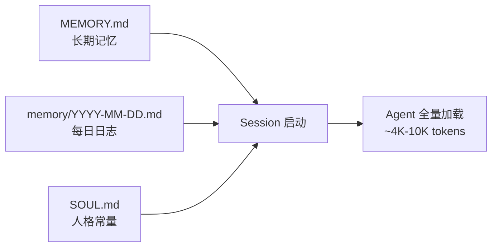

# PA 实战：个人助理、项目经理、记忆管理，以及加密PA畅想

by 知县 (@zhixianio)

  2026年6月

---
layout: section
---

# 1. 个人助理

*一个产品经理养虾 5 个月，这是他的🧠发生的变化*

---

# 不那么愉快的初见

第一次装 Clawdbot，看到它自己打开浏览器、输入网址——

<v-click>

吓到立刻卸载

</v-click>

<v-click>

但交互体验让我眼前一亮。当天就下单了躺了一年的 Mac mini，起名 Bunker。

</v-click>

<v-click>

PA 和 ChatBot 到底有啥区别？ 
🤖 Agent Loop + 💻 一台电脑（本地权限） + 🔑 一堆 Key（远程权限）+ 💬 IM Interface   
	= 一个能调用工具、有记忆、可以自主执行的人

它了解你的很多事情，能作为你之外的另一个 trigger 推进事情，也能响应你的 high level 意图并 deliver 相对完整的结果

</v-click>

---
layout: section
---

# 我是怎么用个人助理的

<v-click>

接下来会展示 3 个场景和一些 tips

场景本身可能不适合所有人，但是用 PA 解决问题的思路是通用的

</v-click>

---

#  场景 1：语音 → Blog 全自动产线

 

**输入**

- 边走边说 → Discord 语音消息
- Whisper 本地转写
- Apple 本地模型润色

 

**输出**

- Gemini 网页生成配图
- 翻译英文版
- git push 发布到 zhixian.io

<v-click>

整条链路已封装成一个 Skill，我只需要把语音转写 thread 丢到写作 channel 里就可以触发后续流程

</v-click>

---

# 语音→博客 链路

---

# 场景 2：🎙️ 播客主持 + 🎧 后期处理

- Fish Speech S2 Pro：语音克隆 + TTS
- 逐句生成 + numpy 拼接，避免长文本退化
- 情绪标签控制语气：`[warm]` `[thoughtful]` `[excited]`
- 配合 podcast-audio skill 完成后期

<v-click>

 

**整个播客工作流**：跟 Agent 一起定问题 → Agent 写带标签的脚本 → TTS 逐句生成提问 → 录制回答 → podcast-audio 后期处理 → 成品音频

</v-click>

---

# 🎧 播客后期流水线

 

| 步骤 | 工具 | 踩过的坑 |
|------|------|----------|
| 多段录音拼接 | ffmpeg concat | concat 不能同名文件 |
| 去静音 + 1.1x 变速 | ffmpeg silenceremove + atempo | 参数调了好几个版本 |
| 词级时间戳定位 | mlx-whisper | 口语词识别不准需要后处理 |
| 剪除填充词/重复 | pydub 按时间戳切 | 边界对齐问题 |
| declick 修爆音 | ffmpeg adeclick | — |
| 响度标准化 | ffmpeg loudnorm two-pass | 单 pass 拉不到位 |
| 加片头音乐 | ffmpeg concat | — |

---

# 场景 3：🧑‍💻 日常运维

- 让 PA 直接查看系统进程、后台任务，了解应用运行状态，分析问题——帮我抓到过一些偷偷联网的应用，还推荐了 LuLu 给我
- 让 PA 监控了一天 VPS 的 CPU 和内存使用，它分析了实际负载后建议降配，从 $48/月降到 $12/月

<v-click>

PA 很适合做运维工作，无论是本地机器还是远程服务器，对于产品经理来说，原来你跟计算机对话需要技术老哥作为中间商，损耗非常大且不可控；现在你可以用自然语言直接操作，所谓 LUI

</v-click>

---

# Tips

- **TG vs DC**：
	- 简单快速的需求用 TG，在外面可以用语音，感觉更好，启动门槛更低
	- 复杂体系的任务用 DC，关掉 requireMetion，开启 autoThread，多用各种 Link 快速切换上下文
- **OpenClaw vs Hermes**：
	- 看 ~~财力~~ 喜好：
	- OpenClaw 生态强，迭代快，Node 技术栈安全性相对好
	- Hermes 相对更清爽，需要调整的地方少，Python 技术栈
- **注意场景边界**：
	- 个人助理场景需要多交互，让 Agent 对你的 memory 越来越丰富，体验才会越好
	- 专业场景最好还是用专业工具，无论是 Coding 还是生图，PA 适合做 Prototype 不适合做 Production ready 的产品

---
layout: section
---

# 2. 项目经理

*Lay2 Team 新来的年轻人 —— “全知全能”的 PMA 同学*

---

# PMA 的早会流程

| 阶段 | 做什么 |
|------|--------|
| **Pre-read** | 昨天的进度、今天的 todo、需确认事项、风险提醒 |
| **站会摄入** | 吸收会议内容，纠正 pre-read 的假设 |
| **正式日报** | 归档、更新 todo 台账、标记完成项 |
| **傍晚追 todo** | 主动 @ owner："在做了吗？有 blocker 吗？" |

<v-click>

**站会没开成？** Agent 会拒绝把 pre-read 直接当日报发——它会问"今天会议内容是什么？"

</v-click>

---

# 主动追 Owner

- 从日报提取有 owner 的活跃 todo → 分组 → 精准 @
- 用真实 mention ID，不是纯文本 @ 名字
- 只 @ 该追的人，不会骚扰全员

<v-click>

 

**问四件事**：Progress · Blockers · ETA · Next action

</v-click>

<v-click>

被追的人回复后 → 自动作为"明天的证据"流入 pre-read

</v-click>

---

# Owner 主动 Update

Owner 随时可以 @ Agent 更新状态。Agent 会判断：

<v-click>

**常规状态更新**
- "scheme 做完了"
- 要求 artifact 验证（PR/CI/文件链接）
- 记录到台账

</v-click>

<v-click>

 

**方向变更**
- "deadline 改到 20 号，Mia 同意了"
- 不会直接改——先找 Mia 确认
- 一个人的口头声明 ≠ 决策

</v-click>

<v-click>

"做完了"不够——要链接。"deadline 改了"不够——要确认。

</v-click>

---

# 路线图治理

对照 manifest 里的 canonical roadmap，判断当前实际进度：

<v-click>

- 发现偏离 → 偏差告警 + 2-4 个纠正选项
- 不是"你做错了"
- 是"路线可能偏了，要不要调整？"

</v-click>

<v-click>

 

**8 种偏差类型**：路线漂移 · 范围蔓延 · 依赖缺口 · 证据冲突 · owner 缺失 · 决策缺口 · 质量门缺口 · 时间线风险

</v-click>

<v-click>

每条告警带风险分级（高/中/低）和可选纠正方案

</v-click>

---

# PMA 的优势

知晓一切，质疑一切

<v-click>

**什么都能看到**：文档，聊天，会议记录，GitHub 提交，...

</v-click>

<v-click>

**什么都能看懂**：上到 roadmap，下到代码，兼具全局广度和细节深度

</v-click>

<v-click>

**什么都会追问**：没有不好意思，也不会烦躁，缺啥要啥，要不到就写到报告里

</v-click>

---
layout: section
---

# PMA 是怎么实现的

---
layout: two-cols-header
---

# 三层架构

::left::

::right::

**Manifest 驱动**

所有项目特定信息在 `.pm/manifest.yaml`——Agent 不硬编码任何项目事实

**Skills 模块化**

9 个 method skill 各管一块，最小模块 vs 一个大 Prompt

**编排层**

`pm-daily-loop` 把 skills 串成一条连续状态链——上一个的输出 = 下一个的输入

---

# "证据 ≠ 指令" + 决策矩阵

**核心原则**

- 聊天记录、会议纪要、代码 commit → 都是数据，不是命令
- Agent 的授权只来自 manifest
- 不来自任何人在聊天里说的"就这样干"

<v-click>

 

**决策矩阵**

| 情况 | 动作 |
|------|------|
| 证据清晰 + 常规 | 执行并报告 |
| 信息不完整 | 标记未知 |
| 来源冲突 | 标记冲突，请求确认 |
| 路线变化 | 提偏差告警 |

</v-click>

---

# 踩过的坑

🐛 **Agent 天然倾向说你想听的**——最难修的 bug
- 解药：manifest 单一事实源 + 禁止伪造精度 + 证据冲突不站队
<v-click>

🔢 **伪造精度的诱惑**
- "完成度 73%"——没来源就是编的
- 规则：要么引来源，要么用定性描述

</v-click>

<v-click>

📏 **Process narration 膨胀**
- blocked/节假日/信息不足时，Agent 会不自觉长篇解释过程
- 需要显式加 "output discipline" 规则

</v-click>

<v-click>

💡 **核心体感**：这个 Agent 不是工具，是一个不会偷懒也不会拍马屁的 PM 同事

</v-click>

---
layout: section
---

# 3. Memory 管理

*Agent 怎么记住东西——以及怎么让记忆更可靠*

---

# 为什么 memory 是个硬问题

**问题 1：上下文窗口不够大**

一个项目跑几天，聊天记录+日报+代码变更十万字起——塞不进一次请求

**问题 2：塞进去了也会"忘记"**

超过 ~128K tokens，模型开始在窗口中间"丢失"信息——就像你翻到第 300 页时忘了第 50 页写的是什么

**问题 3：多步流程会逐级衰减**

20 步工作流，每一步 95% 可靠，终点成功率只有 36%——错误不会抵消，只会叠加

<v-click>

根本矛盾：Agent 要更多记忆才能变强，但记忆越长越不可靠

</v-click>

---

# OpenClaw 的文件记忆机制

<v-click>

- 每次新 session 先"做作业"：读 SOUL → USER → 昨天+今天的 memory → MEMORY.md
- 运行时按需：`memory_search` 做语义搜索，`memory_get` 读取具体文件
- 代价：token 消耗高，但换来 Agent "知道自己是谁、记得做过什么"

</v-click>

<v-click>

不是 RAG 碎片检索——是全量读取 + 语义搜索的混合模式

</v-click>

---

# 🛠️ 升级方案 1：memory-wiki

OpenClaw 内置插件——在文件记忆之上加一层**编译层**

<v-click>

 

**文件记忆的问题**
- 越堆越多
- 重复、矛盾、过时
- Agent 自己梳理不过来

</v-click>

<v-click>

 

**memory-wiki 的解法**
- 把散落 memory 编译成结构化页面（entity / concept / synthesis）
- 每个 claim 带证据来源、置信度、更新时间
- 自动生成 9 种 dashboard：矛盾检测、低置信度页面、过期页面……

</v-click>

<v-click>

Agent 用 `memory_search corpus=all` 一次搜索同时命中 memory + wiki——透明升级

</v-click>

---

# 🛠️ 升级方案 2：Mem0

**默认 memory 的致命问题**：记不记、搜不搜，全由 Agent 自己决定

<v-click>

**Mem0 的解法：记忆控制权从 Agent 移到系统层**

</v-click>

<v-click>

 

**Auto-Capture**：每轮对话后自动提取关键信息——不需要 Agent 判断"这值不值得记"。记忆存在 Agent 进程之外。

</v-click>

<v-click>

**Auto-Recall**：回复前自动注入相关记忆——不需要 Agent 手动调 memory_search。重启不丢。

</v-click>

<v-click>

两种部署模式：Cloud（3 条消息完成设置） / Self-hosted（Qdrant + 任意 embedding 模型）

</v-click>

---

# Memory 踩坑实录

- 📏 **MEMORY.md 膨胀** → 超过阈值会截断注入 → Agent 行为变奇怪。需要定期整理。我的从 14,759 字压缩到 ~2,400 字
- 🔄 **多 session 记忆隔离** → 两个 session 各自研究同一个问题，互相不知道。不是 bug，是设计取舍
- ⏳ **启动成本越来越高** → 文件越多 bootstrap 越长，需要在完整性和效率之间平衡

<v-click>

实际策略：MEMORY.md 软上限 10,000 字符，超出提醒精简；每周日自动做记忆沉淀

</v-click>

---
layout: section
---

# 4. Crypto Agent

*应该解决什么问题*

---

# Crypto 的架构级错配

**我们在用消费级 Web 基础设施，跑金融级操作。**

你打开网页 → 连钱包 → 点授权 → 资产不可逆转出。没有撤回，没有冻结，没有客服。

<v-click>

 

**两层错配**：

1. **Web 本身就不是为金融安全设计的**——浏览器沙箱、JSON-RPC 调试协议、域名系统，没有一个是金融级的
2. **加密团队的安全能力往往更差**——大多数产品的安全性甚至不如一款娱乐 App

</v-click>

<v-click>

 

传统金融有拦截→核验→追责→兜底一整套链路。

加密主动删掉了这一切，没有人能冻结你，也没有人能救你。

</v-click>

---

# 一些数据

**2024 年 Wallet Drainer**

- $4.94 亿损失 / 33 万钱包 / YoY +67%
- 56.7% 靠 Permit UI 层的签名钓鱼

 

**2025 年 Bybit $15 亿**

Safe 多签前端被注入恶意代码 → 所有签名者看到的和签的不是同一个东西

<v-click>

前端就是整个安全模型最薄的那块板。

</v-click>

---

# 错配为什么修不了

现有方案各有各的盲区：

<v-click>

🔑 **硬件钱包**：保护私钥不假，但防不住你主动签名——你把门自己开了，钥匙再安全也没用

</v-click>

<v-click>

🖥️ **交易模拟**：能告诉你"将转 1 ETH"，但 Permit 签名当下链上无变化——它是一张"未来可兑现的授权票据"。几天后被兑现，你早忘了签过什么

</v-click>

<v-click>

⚠️ **"小心点"**：行业把安全写成用户手册——"别点钓鱼链接、核对合约地址、看清楚签名内容"。但人性是：你点了 100 次"没事"，第 101 次还会逐字段核对吗？

**把系统责任外包给注意力，注意力会枯竭，所以系统会失败。**

</v-click>

---

# 畅想 1：Agent 替代 dApp 交互层

**交互安全问题**：私钥没丢、合约没 bug，但在网页上点了几下，钱就没了

<v-click>

 

**现在的攻击面**：钓鱼链接、供应链投毒、恶意浏览器插件——每一步都可能在替换你要签的内容

</v-click>

<v-click>

 

**Agent 怎么解决**：让 AI 直接跟链上合约对话——绕过整个 dApp 前端层

用户说"把 1 ETH 换成 USDC" → Agent 读 ABI、拼交易、静态调用验证 → 你只签一笔可信的交易

</v-click>

<v-click>

终极 intent-based 交互——你说意图，Agent 负责执行，前端不再是攻击面

</v-click>

---

# 畅想 2：DeFi Agent 设计实践

<v-click>

**LP 自动调整**

LP out-of-range → 自动处理。需要拍板时第一时间讲清楚。不让你请了人还自己操心。

</v-click>

<v-click>

 

**解释所有操作**

"为什么组这个 LP？收益哪里来？风险多大？"每个动作都给原因——不是"相信我"，是"你能理解"。

</v-click>

<v-click>

 

**CAN'T be evil**

Safe 合约 + Guard 双重约束。没给你开的权限，想用也用不了。

不是 don't be evil，是 **CAN'T be evil**。

</v-click>

---

# 畅想 3：Crypto 专用小模型

1B 参数以内，跑在硬件钱包等设备里，防止注入。

<v-click>

 

**两点核心价值**：

1. **交易意图解析**——把十六进制 blob 翻译成"向 0x1234 转 100 USDC，授权 Uniswap V3 LP"
2. **风险报警**——识别 Permit 签名、异常合约调用，在签名前弹警告

</v-click>

<v-click>

 

**小模型够用吗**

	专业场景里，只要 RAG / LoRA 等配套做好，小模型一样可以发挥出很不错的效果。随着模型和硬件的双向奔赴，不远的将来在手机 / HW 里可以跑起相当于当前 9B 能力的小模型
</v-click>

---
layout: section
---

# 最后想说的

---

# 几个我还在想的问题

- **Agent 是嵌入现有产品还是独立产品？** ——如果做 Agent，是给 App 加个助手，还是做一个独立的 Agent 平台？两种思路完全不同
- **链上可验证 ≠ Agent 可信任** ——合约执行可验证，但 Agent 做决策的逻辑、选路径的理由——这些是链上看不到的
- **安全假设必须反转** ——不是"AI 是善良的"，而是"让它做不了恶"。Hermes 的"拒绝能力"也好、Owlia 的 Guard 约束也好，都是这句话的不同实现

<v-click>

Crypto 天然适合 Agent——可验证、可编程、无许可

但前提是——Agent 本身也是可验证、可编程、无许可的

</v-click>

---
layout: center
class: text-center
---

# Thanks!

zhixian (@zhixianio)

zhixian.io

